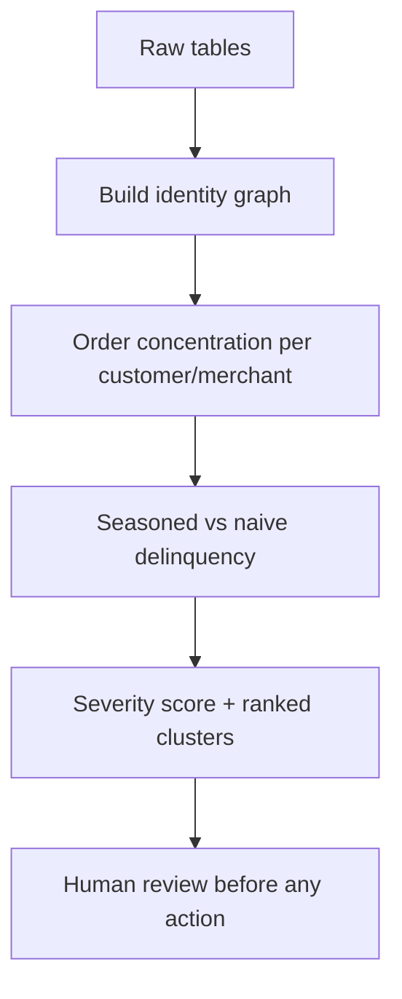

# Approach

_A short note or a few slides walking through your collusion-detection approach
as a flowchart / diagram (see the assignment). Aim for something a risk analyst
who does not read SQL could follow — from building the identity graph, through
your concentration and seasoned-delinquency measures, to the ranked cluster
output and where a human reviewer would step in._

<!-- A Mermaid flowchart, an embedded image, a linked PDF, or plain ASCII are
     all fine — the format is not graded, the clarity is. Example scaffold: -->

