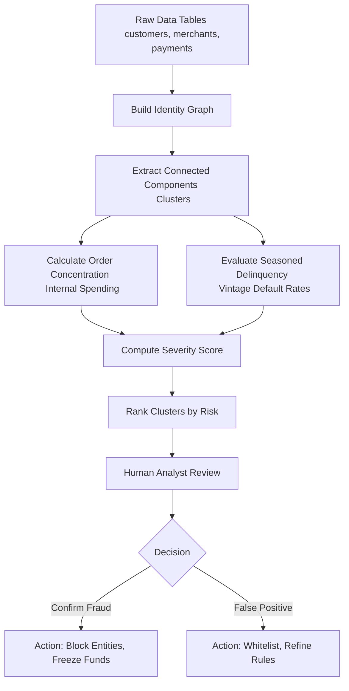

# Approach

This document outlines our approach to detecting collusion and organized fraud rings. The methodology is designed for risk analysts to trace anomalous behavior from raw data to actionable insights, using a combination of graph analysis, behavioral metrics, and human-in-the-loop review.

## Collusion Detection Workflow

## Step-by-Step Methodology

### 1. Building the Identity Graph
Organized fraud rings operate by sharing infrastructure. We map connections between `customers` and `merchants` based on shared attributes:
- **PII:** Shared Emails, Tax IDs.
- **Payment Instruments:** Shared Credit Card Fingerprints, Bank Account Fingerprints.

By treating these entities as "nodes" and their shared attributes as "edges", we create a comprehensive identity graph.

### 2. Extracting Clusters (Connected Components)
Using recursive SQL (Common Table Expressions), we traverse the identity graph to find "Connected Components". If Customer A shares a card with Merchant B, and Merchant B shares a Tax ID with Merchant C, they are all grouped into a single cluster. Normal behavior yields small, isolated clusters (e.g. a merchant using their own card). Large, highly connected clusters indicate synthetic identity rings or coordinated fraud.

### 3. Measuring Order Concentration
In a collusion scheme, fake customers often place orders primarily with fraudulent merchants within the same network to extract cash. We measure "Order Concentration" by checking what percentage of a customer's spending is routed to merchants inside their own identity cluster versus external, legitimate merchants. High internal concentration (self-dealing) is a strong indicator of collusion.

### 4. Evaluating Seasoned Delinquency
To understand the financial impact, we look at default rates over time using Cohort Vintage Curves (Months on Book). This helps us differentiate between:
- **Naive Defaults:** New accounts that immediately default (often first-party fraud or systemic onboarding gaps).
- **Seasoned Defaults:** Accounts that pay normally for months to artificially inflate their credit limits, then suddenly default in a coordinated "bust-out" attack.

Clusters exhibiting steep early default spikes or sudden, coordinated seasoned defaults are flagged.

### 5. Severity Scoring and Ranking
We combine the metrics into a single Severity Score for each cluster based on:
- **Cluster Size:** Total number of connected identities.
- **Concentration:** Percentage of self-dealing transactions.
- **Loss Exposure:** Total credit limit or current default amounts.

Clusters are ranked by this severity score, prioritizing the most damaging networks for immediate attention.

### 6. Human Review & Action
Fraud detection algorithms can generate false positives (e.g., roommates sharing a Wi-Fi IP). Therefore, no automated bans are issued immediately based solely on graph size. 
- High-severity clusters are presented to Risk Analysts using interactive visual network graphs.
- The analyst visually confirms the "fraud ring" pattern (looking for dense hairballs or star patterns).
- Upon confirmation, analysts take decisive action: blocking the involved IDs, freezing funds, and logging the actions in the audit trail.
